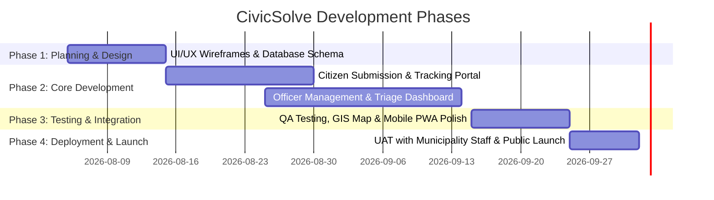

# Project Proposal & Requirements Specification: Municipality Citizen Complaint & Management System (CivicSolve)

## 1. Executive Summary
The **Municipality Citizen Complaint & Management System** (CivicSolve) is a modern web application designed to bridge the communication gap between citizens and local municipality authorities. The platform enables citizens to submit, track, and receive updates on public issues (e.g., road damage, waste management, streetlight failures, water supply issues) while empowering municipality officers with tools to assign, track, update, and resolve complaints efficiently with data-driven insights.

---

## 2. Target Audience & Stakeholders

1. **Citizens / Public**: Residents living within the municipality who need to report civic issues and track resolution progress easily.
2. **Municipality Officers / Staff**: Department personnel responsible for triaging, inspecting, addressing, and resolving filed complaints.
3. **Department Managers / Super Admins**: Municipality executives who need analytics, performance metrics, SLA compliance reports, and system oversight.

---

## 3. Core Functional Requirements

### 3.1 Citizen Portal (Public Facing)
* **User Authentication & Profile**:
  * Quick signup/login via Email/OTP or Social Login (OAuth).
  * Citizen profile management (contact info, address, preferred notification channel).
* **Complaint Submission**:
  * **Categorization**: Selection of department/category (e.g., Infrastructure, Sanitation, Water Utilities, Traffic/Parks).
  * **Location Tagging**: Interactive GPS map selector and address auto-complete.
  * **Media Upload**: Ability to attach images, videos, and documents demonstrating the issue.
  * **Detailed Description**: Description field, urgency level selector, and optional anonymous reporting mode.
* **Tracking & History**:
  * **Real-time Status Tracker**: Stepper interface showing status (`Submitted` -> `Under Review` -> `Assigned` -> `In Progress` -> `Resolved` -> `Closed`).
  * **Timeline & Updates**: Log of comments, photos of fixed work, and officer notes.
  * **Notifications**:
  * Real-time browser push notifications (via FCM) when a complaint status is updated or an officer comments.
  * In-app notification center, SMS, or Email alerts.
* **Feedback & Rating**:
  * Ability for citizens to rate resolution quality (1 to 5 stars) and provide feedback upon closure.

---

### 3.2 Officer & Admin Dashboard (Internal Facing)
* **Officer Authentication & Role Management**:
  * Role-Based Access Control (RBAC): `Field Officer`, `Department Supervisor`, `System Admin`.
* **Complaint Triage & Queue Management**:
  * **Centralized Kanban / Table View**: View all incoming complaints with filters (Urgency, Category, Location, Status, Officer Assigned).
  * **Interactive Heatmap / GIS View**: Visual map representing complaint clusters across the municipality.
* **Workflow & Assignment**:
  * **Assignment Engine**: Manual or automatic assignment of complaints to field officers or specific municipal sub-departments.
  * **SLA & Priority Escalation**: Automatic visual flags/timers for overdue complaints exceeding response SLAs.
* **Status & Work Progress Tracking**:
  * Ability to change ticket statuses and attach proof-of-work (e.g., photo of completed repair).
  * Internal team notes and direct messaging/updates sent back to the citizen.
* **Analytics & Reporting**:
  * Dashboard metrics: Total Complaints, Resolution Rate, Average Response Time, Category Breakdown.
  * Exportable PDF/Excel reports for weekly/monthly municipal meetings.

---

## 4. Non-Functional Requirements

* **Performance & Scalability**:
  * Sub-2 second load times for public pages and optimized image rendering for uploaded media.
  * Built to handle spikes in traffic during municipal emergencies (e.g., heavy storms, water outages).
* **Usability & Accessibility (UX/UI)**:
  * Fully responsive design optimized for mobile phones (PWA support recommended for field officers and citizens).
  * High-contrast design, clean typography, WCAG 2.1 AA accessibility compliance for diverse citizen demographics.
* **Security & Privacy**:
  * Data encryption in transit (HTTPS/TLS) and at rest.
  * Protection of personally identifiable information (PII) of citizens.
  * Protection against spam submissions (CAPTCHA integration).
* **Availability & Reliability**:
  * 99.9% uptime SLA with regular database backups.

---

## 5. System Architecture & Tech Stack (Firebase Ecosystem)

* **Hosting & Web Application (Frontend)**:
  * **Firebase Hosting**: Global CDN deployment offering SSL, fast static content serving, and single-command deployment.
  * **Framework**: React / Vite (SPA) or Next.js (SSG/SSR deployed via Firebase Hosting & Cloud Functions).
  * **Styling**: Modern CSS / Tailwind CSS with PWA support.
* **Backend Services & Cloud Logic**:
  * **Firebase Authentication**: Out-of-the-box support for Email/Password, Phone OTP, and Social OAuth (Google, Facebook) with custom claim roles (`Citizen`, `Officer`, `Admin`).
  * **Cloud Functions for Firebase**: Serverless Node.js / TypeScript microservices for automated complaint assignment logic, SLA monitoring timers, and notification triggers.
  * **Firebase Cloud Messaging (FCM)**: Cross-platform web push notification service to deliver browser alerts to citizens (status changes) and officers (new complaints/escalations) even when the app tab is in the background.
* **Database & Data Storage**:
  * **Cloud Firestore**: Scalable NoSQL document database providing real-time synchronization, document-level security rules, and offline data persistence for field officers.
  * **Geohashing / GeoFirestore**: Spatial indexing for complaint location queries and heatmap visualization.
* **Media Storage & Maps**:
  * **Cloud Storage for Firebase**: Secure, scalable blob storage for complaint photos, videos, and proof-of-work documents.
  * **Mapping API**: Google Maps JavaScript API or Mapbox / OpenStreetMap API integrated for geolocation selection and tracking.

---

## 6. Implementation Roadmap

---

## 7. Implementation Status & Accomplishments

- [x] Review and approve functional requirements with municipality department heads.
- [x] Finalize role permissions (Google OAuth Strategy 2) and department workflow hierarchy.
- [x] Citizen submission flow with HTML5 GPS Geolocation & Leaflet map picker.
- [x] Direct image upload service with Cloud Storage for Firebase integration.
- [x] Real-time Cloud Firestore synchronization across devices.
- [x] Super Admin User Management UI for role/department assignment (`pchaowmobile@gmail.com`).
- [x] Live production deployment on Firebase Hosting: [https://testagy-001.web.app](https://testagy-001.web.app).
