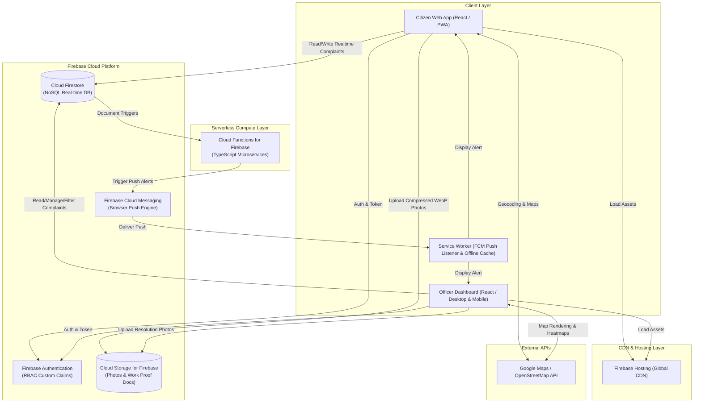
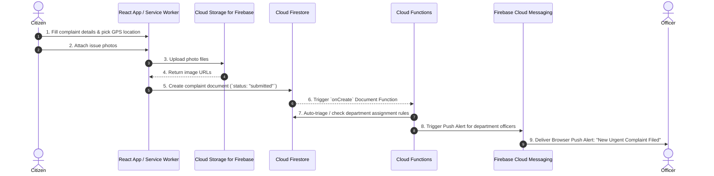
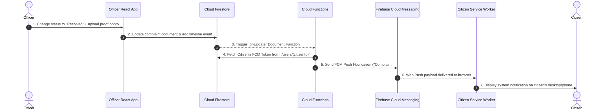

# System Architecture & Technical Design Specification: CivicSolve (Municipality Citizen Complaint System)

## 1. High-Level System Architecture

The CivicSolve application follows a serverless cloud-native architecture powered by **Google Firebase** and a client-side Web / PWA Single Page Application (SPA).



---

## 2. Database Schema Design (Cloud Firestore)

Firestore organizes data into collections of documents.

### 2.1 Core TypeScript Interfaces & Types (`src/types/index.ts`)

```typescript
export type UserRole = 'citizen' | 'officer' | 'supervisor' | 'admin';
export type Department = 'infrastructure' | 'sanitation' | 'water_works' | 'electricity' | 'traffic';
export type ComplaintStatus = 'submitted' | 'under_review' | 'assigned' | 'in_progress' | 'resolved' | 'rejected' | 'closed';
export type UrgencyLevel = 'low' | 'medium' | 'high' | 'critical';

export interface UserProfile {
  uid: string;
  fullName: string;
  email: string;
  phone?: string;
  role: UserRole;
  department?: Department | null;
  fcmTokens: string[];
  createdAt: string;
  updatedAt: string;
}

export interface GeoLocation {
  address: string;
  latitude: number;
  longitude: number;
  geohash: string;
}

export interface Attachment {
  id: string;
  url: string;
  type: string;
  uploadedAt: string;
}

export interface ResolutionData {
  notes: string;
  proofAttachments: string[];
  resolvedAt: string;
  resolvedByOfficerId: string;
}

export interface CitizenFeedback {
  rating: number; // 1 - 5
  comment?: string;
  submittedAt: string;
}

export interface TimelineEvent {
  eventId: string;
  type: 'submitted' | 'status_changed' | 'officer_assigned' | 'comment_added';
  performedBy: {
    uid: string;
    name: string;
    role: UserRole;
  };
  previousStatus?: ComplaintStatus;
  newStatus?: ComplaintStatus;
  message: string;
  timestamp: string;
}

export interface ComplaintDocument {
  complaintId: string;
  trackingNumber: string;
  citizenId: string;
  citizenName: string;
  category: Department;
  title: string;
  description: string;
  status: ComplaintStatus;
  urgency: UrgencyLevel;
  isAnonymous: boolean;
  location: GeoLocation;
  attachments: Attachment[];
  assignedDepartment?: Department;
  assignedOfficer?: {
    uid: string;
    name: string;
    assignedAt: string;
  };
  resolution?: ResolutionData;
  feedback?: CitizenFeedback;
  createdAt: string;
  updatedAt: string;
}
```

---

## 3. Data Flow & Sequence Diagrams

### 3.1 Filing a Complaint & Automatic Push Alert Flow



### 3.2 Status Update & Citizen Browser Push Notification



---

## 4. Security & Access Control (Firestore Rules & Auth)

### 4.1 Role-Based Access Control (RBAC) Strategy
Using Firebase Auth Custom Claims (`request.auth.token.role`):

* **Citizen (`role == 'citizen'`)**:
  * Read: Own submitted complaints (`resource.data.citizenId == request.auth.uid`).
  * Create: New complaints where `request.resource.data.citizenId == request.auth.uid`.
  * Update: Only allowed to append feedback rating to their own resolved complaints.
* **Officer (`role == 'officer'`)**:
  * Read: All complaints belonging to their assigned `department`.
  * Update: Change complaint status, update assignment, and append resolution notes/proof photos.
* **Supervisor / Admin (`role == 'admin'`)**:
  * Read / Write: Full read and write access across all documents and collections.

---

## 5. Browser Push Notification Architecture

### 5.1 Registration & Permission Flow
1. Citizen/Officer logs in to the Web App.
2. Web App requests permission via standard `Notification.requestPermission()`.
3. If granted, the app calls `getToken(messaging, { vwapKey: '...' })`.
4. The FCM token is stored in the user's document in Firestore (`/users/{uid}`).

### 5.2 Service Worker (`firebase-messaging-sw.js`)
* Handles background notifications when the web tab is closed.
* Parses payload and triggers `self.registration.showNotification(title, options)`.
* Clicking the notification opens the complaint tracking URL directly (`/track/MUN-2026-8890`).

---

## 6. Frontend Component Architecture (React Modular Structure)

```
src/
├── types/
│   └── index.ts             # Strong TypeScript interfaces & data models
├── components/
│   ├── common/
│   │   ├── Header.tsx
│   │   ├── ProtectedRoute.tsx
│   │   └── StatusBadge.tsx
│   ├── citizen/
│   │   ├── ComplaintForm.tsx
│   │   ├── LocationPickerMap.tsx
│   │   ├── StepperTracker.tsx
│   │   └── NotificationPermissionBanner.tsx
│   └── officer/
│       ├── ComplaintKanban.tsx
│       ├── ComplaintTable.tsx
│       ├── HeatmapMap.tsx
│       └── ProofOfWorkModal.tsx
├── services/
│   ├── firebase.ts          # Firebase SDK init with TS types
│   ├── authService.ts       # Auth helpers & custom claim handling
│   ├── complaintService.ts  # Typed Firestore queries & real-time listeners
│   └── fcmService.ts        # FCM notification registration & token handler
├── context/
│   └── AuthContext.tsx
└── pages/
    ├── CitizenDashboard.tsx
    ├── FileComplaint.tsx
    ├── TrackComplaint.tsx
    └── OfficerDashboard.tsx
```

---

## 7. Next Steps for Implementation

1. Initialize Vite + React project workspace in repository.
2. Set up Firebase Project config and standard `firebase.js` SDK wrapper.
3. Build shared design system & CSS components.
4. Implement citizen reporting flow & real-time tracker.
5. Implement officer triage dashboard & real-time Firestore listeners.
