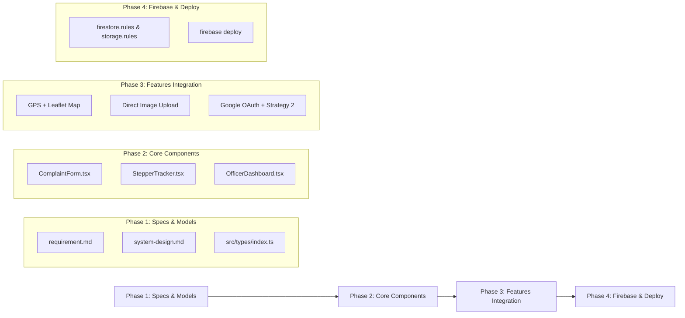

# 🛠️ CivicSolve: Development Guide & Engineering Walkthrough

> **A Step-by-Step Developer Presentation on Building CivicSolve using React, TypeScript, and Firebase**

---

## 📋 Slide 1: Development Overview & Philosophy

### **Engineering Principles**:
* **Cloud-Native & Serverless**: Built using **Google Firebase** to eliminate monolithic backend server maintenance.
* **Type-Safe Architecture**: Written 100% in **TypeScript** with strict interface definitions.
* **Component-Driven UI**: Modular React design system with custom CSS tokens.
* **Thai Localization First**: Full Thai (`TH`) interface for local municipal adoption.

---

## 🏗️ Slide 2: Project Initialization & Directory Structure

```
civic-app/
├── public/
│   └── firebase-messaging-sw.js  # FCM Web Push Service Worker
├── src/
│   ├── types/index.ts            # Core TypeScript interfaces & data models
│   ├── services/
│   │   ├── firebase.ts           # Firebase SDK initialization
│   │   ├── authService.ts        # Google OAuth & Firestore Strategy 2 Role lookup
│   │   ├── complaintService.ts   # CRUD logic & state management
│   │   ├── storageService.ts     # Firebase Storage & base64 fallback
│   │   └── fcmService.ts         # Browser push notification triggers
│   ├── components/
│   │   ├── common/Header.tsx     # Navigation & Google Auth login gate
│   │   ├── citizen/              # Form & Leaflet LocationPickerMap
│   │   ├── officer/              # Triage Dashboard & Resolution Modal
│   │   └── admin/UserManagement  # Super Admin Role Management UI
│   └── App.tsx
├── firebase.json                 # Firebase Hosting rewrite & caching rules
├── firestore.rules               # Production RBAC database security rules
└── storage.rules                 # Media upload security rules
```

---

## 💻 Slide 3: Step-by-Step Implementation Workflow



---

## 📍 Slide 4: Key Feature Implementations

### **1. GPS Geolocation & Map Integration**:
* Native HTML5 `navigator.geolocation` triggers GPS coordinates.
* OpenStreetMap reverse geocoding via Nominatim API.
* Interactive Leaflet map pin picker (`LocationPickerMap.tsx`).

### **2. Direct Image Upload & Canvas Compression**:
* `uploadFileToFirebase()` in `storageService.ts` automatically resizes heavy camera photos (5-10MB) to 1024px WebP images (~50-150KB) using HTML5 Canvas.
* Saves 90% cloud storage bandwidth and costs.

### **3. Automated Release Version Guardrails**:
* `versionGuardrail.ts` (`APP_VERSION = 'v1.1.0'`) checks and purges outdated client LocalStorage caches upon new app releases.

### **4. Google Auth & Role Assignment (Strategy 2)**:
* `pchaowmobile@gmail.com` configured as Super Admin.
* Firestore `/users/{uid}` lookup determines `officer` or `admin` permissions dynamically.

---

## 🚀 Slide 5: Building & Deploying to Live Production

### **1. Test Production TypeScript Build**:
```bash
cd civic-app
npm run build
```
*(Runs `tsc -b && vite build` ensuring 0 TypeScript errors).*

### **2. Deploy to Live Firebase Hosting**:
```bash
npx firebase-tools deploy --only hosting --token "$FIREBASE_TOKEN"
```

### **3. Live Application URL**:
👉 **[https://testagy-001.web.app](https://testagy-001.web.app)**

---

## 🔍 Slide 6: Developer Local Setup Instructions

1. **Clone repository & navigate to app**:
   ```bash
   cd /home/chaow/testagy/civic-app
   ```
2. **Install dependencies**:
   ```bash
   npm install
   ```
3. **Run local development server**:
   ```bash
   npm run dev
   ```
   *(Opens dev server at `http://localhost:5173/` or `5174/`)*.
