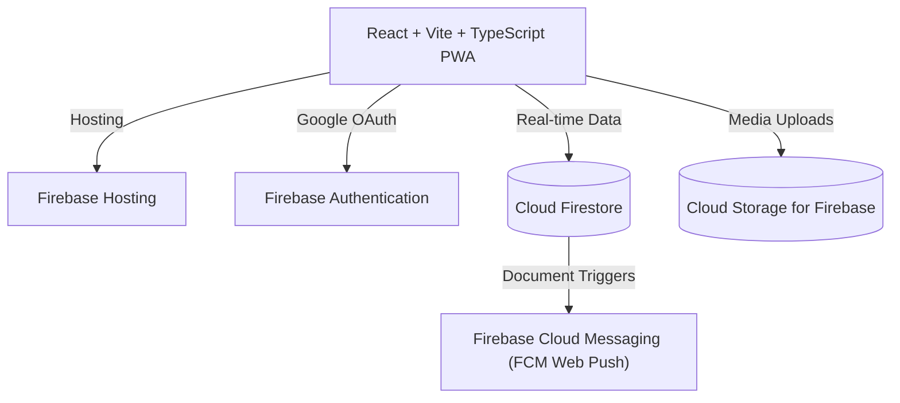

# 🏛️ CivicSolve: Municipality Citizen Complaint & Management System

> **A Modern Cloud-Native Civic Tech Platform Empowering Citizens & Streamlining Municipal Operations**

---

## 📋 Slide 1: Title & Overview

### **CivicSolve (ระบบแจ้งเรื่องร้องเรียนเทศบาล)**
* **Vision**: Transforming municipal grievance management with real-time tracking, transparent officer workflows, and instant web notifications.
* **Live Application URL**: [https://testagy-001.web.app](https://testagy-001.web.app)
* **Target Audience**: Citizens/Public Residents, Field Officers, Municipal Department Supervisors, and Executive Admins.

---

## 🚨 Slide 2: Problem Statement & Solution

### **The Problem**:
1. **Communication Gap**: Citizens report issues via slow paper forms or phone calls with zero status visibility.
2. **Untracked Resolution**: Officers lack a centralized triage system to assign, track, and attach proof-of-completion photos.
3. **No Real-Time Alerts**: Lack of instant alerts causes delayed responses and public dissatisfaction.

### **The CivicSolve Solution**:
* **1-Click Citizen Filing**: GPS location tagging, interactive map pin selector, and direct photo uploads.
* **5-Stage Stepper Tracker**: Real-time status tracking (`รับเรื่องแล้ว` ➔ `กำลังตรวจสอบ` ➔ `มอบหมายงาน` ➔ `กำลังซ่อมแซม` ➔ `แก้ไขสำเร็จ`).
* **Officer Triage Portal**: Kanban-style queue management with Role-Based Access Control via Google OAuth.

---

## ⚙️ Slide 3: System Architecture & Tech Stack

* **Frontend**: React, Vite, TypeScript, Leaflet / OpenStreetMap, Lucide Icons.
* **Backend Platform**: Google Firebase (Hosting, Auth, Firestore, Cloud Storage, FCM).
* **Localization**: Full Thai Language (`TH`) interface.

---

## 📱 Slide 4: Key Citizen Features

1. **GPS Geolocation & Map Pinning**:
   * One-tap browser GPS coordinate detection (`navigator.geolocation`).
   * Reverse geocoding to human-readable Thai addresses via OpenStreetMap.
2. **Direct Image Uploads**:
   * Drag-and-drop file upload zone supporting PNG, JPG, and WEBP.
   * Multi-file preview and storage in Cloud Storage for Firebase.
3. **5-Star Resolution Feedback**:
   * Citizens can view officer proof-of-work photos and submit rating feedback upon ticket closure.

---

## 🛡️ Slide 5: Officer & Super Admin Features

1. **Google OAuth Authentication**:
   * Protected access gate preventing unauthorized entry to municipal queue.
2. **Super Admin Role Management**:
   * Strategy 2 Firestore lookup allowing Super Admin (`pchaowmobile@gmail.com`) to assign officer roles and department scopes (`โครงสร้างพื้นฐาน`, `สาธารณสุขและขยะ`, `การประปา`, `ไฟฟ้าและแสงสว่าง`, `จราจร`).
3. **Proof-of-Completion Gallery**:
   * Officers must attach completed work photos before marking tickets as `Resolved`.

---

## 🚀 Slide 6: Live Deployment & Roadmap

* **Status**: Fully deployed & live on **Firebase Hosting**.
* **Production Link**: [https://testagy-001.web.app](https://testagy-001.web.app)
* **Future Roadmap**:
  * Executive Analytics Dashboard (PDF/Excel exports).
  * Progressive Web App (PWA) offline installation manifest.
  * Integration with official municipality custom domain (`.go.th`).
