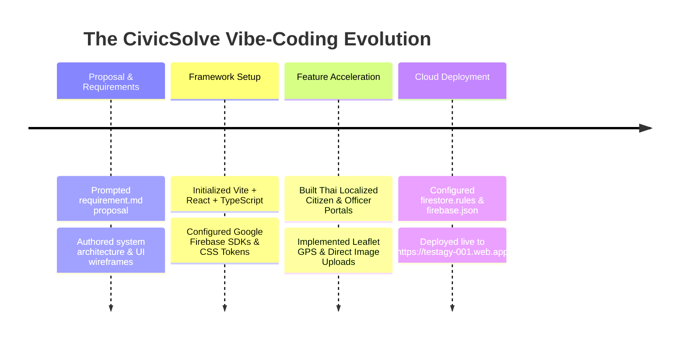

# 🎨 Vibe-Coding Tutorial & Workflow: Building CivicSolve with AI Pair Programming

> **A Guide to Rapid Application Development & Prompt-Driven Engineering using Antigravity AI**

---

## 🌊 Slide 1: What is "Vibe-Coding"?

### **The Vibe-Coding Philosophy**:
* **Vision Over Syntax**: Focus on high-level architecture, user experience, and feature requirements while the AI coding assistant implements precise TypeScript code, components, and cloud services.
* **Iterative & Natural Language Driven**: Transform ideas into live web apps through continuous natural conversation, instant feedback, and visual verification.
* **Full-Stack Execution**: From writing initial proposal documents (`requirement.md`) to deploying live apps on Firebase Hosting without leaving your flow state.

---

## 🚀 Slide 2: The CivicSolve Vibe-Coding Journey

---

## 🎯 Slide 3: Master Class - Vibe-Coding Prompts & Techniques

### **Technique 1: Context Reference (`@[file]`)**
Give explicit context to the AI assistant using file tags.
* *Example Prompt*: 
  > `"help me write @[proporsal/requirement.md] to create web application for people in Municipality to File a complaint"`

### **Technique 2: Expressing Feature Intent Naturally**
Describe *what* you want in plain language without worrying about boilerplate.
* *Example Prompts*:
  * `"adjust backend and frontend tech stack support google firebase hosting and firebase data storage"`
  * `"can we use browser notification"`
  * `"use typescript"`
  * `"how about file upload can we use firebased store as upload file or not"`

### **Technique 3: Instant Localization & Role Customization**
* *Example Prompts*:
  * `"translate this app to thai"`
  * `"i need use auth with google instead enter username and password"`
  * `"superadmin gmail is pchaowmobile@gmail.com"`

---

## ⚡ Slide 4: Best Practices for Vibe-Coding

1. **Verify Early & Often**:
   * Run production build checks (`npm run build`) frequently during feature development to catch TypeScript interface mismatches early.
2. **Dual-Mode Fallbacks**:
   * Always design services with a fallback (e.g. `uploadFileToFirebase()` uses Cloud Storage when keys exist, and `FileReader` base64 data URLs for instant local testing).
3. **Interactive Visual Feedback**:
   * Generate UI mockups and preview wireframes (`ui-design.md`) before launching major feature builds.

---

## 🏆 Slide 5: The Vibe-Coding Result

* **Time to Build**: Built in minutes through natural prompt-driven pair programming.
* **Final Deliverable**: Production-ready, fully responsive, Thai-localized Municipality Citizen Complaint System.
* **Live Firebase Hosting**: 👉 **[https://testagy-001.web.app](https://testagy-001.web.app)** 👈
